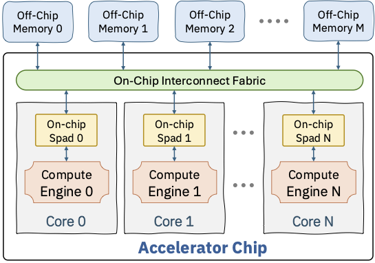

# **SuperDSC-Bundle Interface Specification**

**Authors:**
* @lupalby
* @Prasanth-Chatarasi
* @bmahjour
* @viji560
* @vswagath1989

## **Summary**

This RFC describes the `SuperDSC-Bundle`, the interface between torch-spyre frontend compiler and the Spyre backend compiler (Deeptools).

## **Motivation**
The interface is essential to connect the torch-spyre frontend compiler with the Deeptools backend compiler to successfully map any operation to Spyre.

## **Proposed Implementation**

`SuperDSC-Bundle` views the sypre hardware at the data-parallel level of hardware abstraction. In this abstraction, Sypre is viewed as having multiple cores, with each core having a compute engine and a scratchpad memory. The cores are interfaced with each other and off-chip memory banks using an on-chip interconnect fabric.

<p align="center">
  
</p>
<p align="center">
  Figure 1. Hardware abstraction of multi-core accelerator embodied in `SuperDSC-Bundle`
</p>  

`SuperDSC-Bundle` enables the frontend compilers to express data-parallel mappings of:
* Complex kernels comprised of a sequence of operations
* The work division (or computation split) across RaPiD cores of Spyre for each operation,
* The placement of input/output tensors to each operation either in DDR memory or LX scratchpad of the RaPiD cores
* Shapes of the operations and tensors is allowed to be static or symbolic
* The start address of the tensors in DDR and LX is allowed be a fixed number or symbolic

The `SuperDSC-Bundle` specification is used by the Deeptools backend compiler to produce `SpyreCode` containing the job binary, a job plan and other compiled artifacts. In the scenario, where either the start-address and/or shapes are symbolic, `SpyreCode` allows for the program binary to contain variables that need to be substituted or corrected before execution. The mechanism to effect program correction just-in-time before the job is launched onto spyre is also produced by the backend compiler as part of `SpyreCode`.

NOTES:
* Frontend/Backend compiler interface will transition to a new interface called Kernel Tile Intermediate Representation (KTIR) in the future (https://github.com/torch-spyre/torch-spyre/blob/main/RFCs/0682-KtirSpec/0682-KtirSpecRFC.md)
* `SuperDSC` (without bundle capability) is the current interface between Deeptools frontend compiler and Deeptools backend compiler
* `SpyreCode` is tracked through: https://github.com/torch-spyre/torch-spyre/issues/277

## Structure of SuperDSC-Bundle

The backend expects the frontend to produce multiple output files, that work in conjuction to instruct the backend on how one or multiple programs can be compiled and executed in a sequence as part of a complex kernel. The expectation is to receive:
* one or more sdsc.json files, each describing a Spyre operation
* one mlir file with the SuperDsc-Bundle IR

### SuperDSC-Bundle intermediate representation in mlir

This intermediate representation (IR) in mlir conveys a complex kernel made of one or multiple operations. This IR can be used to chain together multiple operations in a sequence and/or to add loops around them. This is achieved through new and existing mlir operations.

#### `sdscbundle.sdsc_execute` op

The central operation in this IR is a new operation we introduce to instantiate a SuperDSC in the execution plan of the complex kernel. This is an example:

```mlir
sdscbundle.sdsc_execute (%A_start_address, %B_start_address) {sdsc_filename="sdscA.json", symbol_ids=[-1, -2]}
```

The operation does not **return** anything.

The operation **attributes** are:
* `sdsc_filename` the relavite path and filename of the specific sdsc.json to instantiate, relative to the location of the mlir file. As one bundle can contain multiple sdsc, different names must be chosen for each json file and here we can refer to the exact one of interest.
* `symbol_ids` list of the symbol ids used inside the sdsc, if any, to represent symbolic start addresses or sizes

The operation **operands** are the SSA variables corresponding to the values to be assigned to the symbols listed in `symbol_ids`, passed in the same order as the symbol ids. These values can be constants (`arith.constant`), or the result of affine expressions, like [`affine.apply`](https://mlir.llvm.org/docs/Dialects/Affine/#affineapply-affineaffineapplyop). The affine expressions can be comprised of constants and loop iterators. Having actual symbols in mlir will be supported through the next revision of the spec.

#### Loops
Loops are represented using [`scf.for`](https://mlir.llvm.org/docs/Dialects/SCFDialect/#scffor-scfforop) operation borrowed from MLIR's SCF dialect. This allows SuperDSC-Bundle to describe complex kernels with multiple levels of loops and multiple SDSCs.

We do not support loop carried variables, the only supported scenario is the direct use of the induction variable (loop iterator).

The loop bound should be a constant. Symbolic loop bound will be enhanced in the next revision of the spec.

### `sdsc.json` filling

The individual fields of the SuperDSC to express an operation and its core mapping is described below:
* Each SuperDSC contains a vector to express core work mapping for an operation.
  * Field: `sdsc.dscs_`
  * With balanced work division, only one entry in the vector is needed
    * `sdsc.dscs_[0]`
  * **DesignSpaceConfig can represented BOTH deep learning operators and data-shuffle operations** (stick-breaking, non-stick breaking, gather, scatter)
* Operation(s) to perform: `sdsc.dscs_[0].computeOp_`
  * High level operation selection, like GELU, or BATCHMATMUL
    * Field `OpFuncs opFuncName` in `sdsc.dscs_[0].computeOp_[0]`
  * Set the format to execute the operation in (DL16, FP32, …)
    * Field `DataFormats dataFormat_` in `sdsc.dscs_[0].computeOp_[0].attributes_`
  * List input/output tensors involved with the op
    * Fields `std::vector<LabeledDsInfo*> inputLabeledDs`, `std::vector<LabeledDsInfo*> outputLabeledDs` and `std::vector<LabeledDsInfo*> indirectAccessIndexLabeledDs`
* Work division across cores
  * cores involved
    * int `numCoresUsed_` in `sdsc`
    * int `numCoresUsed_` in `sdsc.dscs_[0]`
    * `std::vector<int> coreIdsUsed_` in `sdsc.dscs_[0]`
    * `std::unique_ptr<FoldDimProp>` `coreFoldProp_`, `coreletFoldProp_` in `sdsc`
      * for core fold, factor=maxCoreId
      * for corelet fold, factor=2
      * use these FoldDimProps when initializing any FoldManager below
  * work division
    * number of slices per dimension
      * `std::map<PrimaryDimTypes, int> numWkSlicesPerDim_` in sdsc
    * core to slice mapping per dimension
      * `std::map<int, std::map<PrimaryDimTypes, int>> coreIdToWkSlice_` in sdsc
  * fill data stage parameters
    * total sizes per dimension (across all cores)
      * `DataStructDims N_` in `sdsc.dscs_[0]`
    * sizes per dimension for a single core
      * `std::map<int, dsc2::DataStage> dataStageParam_` in `sdsc.dscs_[0]`
    * add one entry with key 0, and fill ss_ and el_ with same data (name should be “core”)
    * for window/padded operations, add padding information in both datastages above
      * `std::map<PrimaryDimTypes, DimPaddingSizes> paddingSizes_` in `DataStructDims`
      * capture information about front/back padding, stride, related kernel dimension
      * if a padded dimension is chunked across cores, set front/back padding to -1 in “core” datastage
* Input and Output tensors
  * add one entry in `std::vector<LabeledDsInfo> labeledDs_` in `sdsc.dscs_[0]`
  * add one AllocateNode in `sdsc.dscs_[0].scheduleTree_`
  * set data format (dl16, fp32, etc)
    * DataFormats dataFormat_ in `sdsc.dscs_[0].labeledDs_[x]`
  * memory residency (HBM vs LX)
    * `SenComponents component_` in AllocateNode
  * start address per core
    * `FoldManager<int64_t> startAddressCoreCorelet_` in AllocateNode
    * first fold is for cores, set as Map fold type
    * second fold is for corelets, set as Const fold type
  * layout
    * stick layout/sizes
      * add entry in std::map<DsTypes, PrimaryDsInfo> primaryDsInfo_ in sdsc.dscs_[0]
      * fill std::vector stickDimOrder_ and std::vector stickSize_ in primaryDsInfo_ entry
      * multiple tensors can share same primaryDsInfo_ entry if they have same stick layout
    * Layout outside the stick
      * fill `std::vector<PrimaryDimTypes> layoutDimOrder_` in `primaryDsInfo` and `AllocateNode`
      * fill `std::vector<int> maxDimSizes_` in `AllocateNode`
        * set all to -1 (unbound) or to the page size in case of paged value tensor
        * order matched `layoutDimOrder_in` `AllocateNode`
    * scale per dim (to represent reduction/broadcast)
      * 1 is normal, -1 is reduced/broadcasted, -2 is reduced/broadcasted stick dimension
      * `std::vector<double> scale_` in `sdsc.dscs_[0].labeledDs_[x]`
      * order matches layoutDimOrder_ in primaryDsInfo
    * For indirectly accessed tensors (e.g. Paged tensors)
    * fill maxDimSizes_ in AllocateNode of value tensor to set page size
    * mark value/index allocations as such and link them to each other
      * enum class `IndirectAllocType indirectAllocType_` in AllocateNode
      * `AllocateNode- relatedIndirectAccessAlloc_` in AllocateNode
  * Tensor coordinates per dimension
    * `CoordinateType<CoordinateBaseType> allocateCoordinates_` in AllocateNode
    * coordinates arrangement is expressed through a sequence of nested simple affine expressions (alpha*index + beta)
      * “factor” is the cardinality of the fold
    * There is no limit on the number of element arrangement folds
    * The combined factor (multiplied) should correspond to the number of elements in that dimension for the tensor
    * Example:
      * coordinate sequence: 0, 1, 2, 3, 64, 65, 66, 67, 4, 5, 6, 7, 68, 69, 70, 71
      * coordinates arrangement (outer to inner)
        * alpha=4, beta=0, factor=2
        * alpha=64, beta=0, factor=2
        * alpha=1, beta=0, factor=4
      * coordinates also require spatial folds
        * core fold
          * for HBM, N/A → alpha=1, factor=1
          * for LX, alpha=coordinate offset across slices, factor=number of slices in dimension
        * corelet fold: N/A → alpha=1, factor=1
        * row fold: N/A → alpha=1, factor=1
      * **NOTE**: the tensor allocation need NOT be compatible with compute work division i.e, data in one core is directly available for compute in another core. The backend compiler will ensure proper data movement across cores. This functionality is not yet available in the backend, it will be implemented in a future iteration.
* Symbolic information
  * Link dsc dimensions to symbols
    * `std::map<PrimaryDimTypes, std::vector<VariableSymbol>> dimToSymbolMapping_` in `sdsc.dscs_[0]`
      * only fill one VariableSymbol per dimension
      * `VariableSymbol` should be a value coming from class `VariableDefinition`
  * in each datastage, fill max value and granularity for symbolic dimensions
    * `std::map<PrimaryDimTypes, SymbolicDimInfo> symbolicDimInfo_` in DataStructDims
  * if a symbolic dimension is divided across cores:
    * number of slices must be a divisor of granularity
    * max and granularity in datastages should be scaled accordingly
    * start addresses per core will need to be symbolic
      * in AllocateNode fill `FoldManager<int64_t> startAddressCoreCorelet_` with VariableSymbol entries
      * set `bool isStartAddrSymbolic_`
* Constants
  * if dataflow requires a constant value to be provided by frontend, a constantInfo entry is needed
  * `std::map<int, dsc2::ConstantInfo> constantInfo_` in `sdsc.dscs_[0]`. Key is irrelevant. Fields to fill:
    * `std::string name_` as agreed with ddl for that operation
    * `DataFormats dataFormat_`
    * `FoldManager<std::vector<uint32_t>> data_`  single constant value in binary format encoded as the dataformat specified above
      * do not replicate the binary encoding to fill the 32 bits if the data format is smaller
      * only fill one entry in the vector
      * first fold is for cores, set as Const fold type if same for all cores, set as Map if value changes across cores (very unlikely)
      * second fold is for corelets, set as Const fold type

### Supported OpFuncs in `sdsc.json`

OpFuncs are specified within sdsc.json as field `OpFuncs opFuncName` in `sdsc.dscs_[0].computeOp_[0]`.

| Category | OpFunc enum | OpFunc string | Notes
| --- | --- | --- | -- |
|  Matmul | BATCHMATMUL_FP8_FWD  |   "batchmatmulfp8"
|         | BATCHMATMUL_FWD  |   "batchmatmul"
|         | BATCHMATMUL_INT4_FWD  |   "batchmatmulint4"
|         | BATCHMATMUL_INT8_FWD  |   "batchmatmulint8"
| Convolution | CONV2D_FP8_FWD  |   "conv2dfp8"
|         | CONV2D_FWD  |   "conv2d"
|         | CONV2D_INT4_FWD  |   "conv2dint4"
|         | CONV2D_INT8_FWD  |   "conv2dint8"
|  Broadcast    |  ADD  |   "add"  | Broadcast supported on any number of dimensions and on one or both inputs
|         | BATCHNORM_FWD  |   "batchnormfwd"
|         | BIASADD  |   "biasadd"
|         | EQUAL  |   "equal"
|         | FNMS  |   "fnms"
|         | GREATEREQUAL  |   "greaterequal"
|         | LAYERNORM_NORM  |   "layernormnorm"
|         | LESSEREQUAL  |   "lesserequal"
|         | MAXIMUM  |   "maximum"
|         | MINIMUM  |   "minimum"
|         | MUL  |   "mul"
|         | NOTEQUAL  |   "notequal"
|         | REALDIV  |   "realdiv"
|         | REVSUB  |   "revsub"
|         | SUB  |   "sub"
|         | WHERE3  |   "where3"
|  Unary  | ABS  |   "abs"
|         | CLIP_FWD  |   "clip"
|         | EXP_FWD  |   "exp"
|         | FAST_EXP_FWD  |   "fastexp"
|         | FAST_SIGMOID_FWD  |   "fastsigmoid"
|         | GELU_FWD  |   "gelufwd"
|         | IDENTITY  |   "identity"
|         | LAYERNORM_SCALE  |   "layernormscale"
|         | LEAKYRELU_FWD  |   "leakyrelufwd"
|         | LOG_FWD  |   "log"
|         | MISH_FWD  |   "mish"
|         | NEG  |   "neg"
|         | RECIPROCAL  |   "reciprocal"
|         | RELU_FWD  |   "relufwd"
|         | RELU6_FWD  |   "relu6fwd"
|         | RSQRT  |   "rsqrt"
|         | SIGMOID_FWD  |   "sigmoid"
|         | SOFTPLUS  |   "softplus"
|         | SILU_FWD  |   "silu"
|         | SQRT_FWD  |   "sqrt"
|         | TANH_FWD  |   "tanh"
|  Reduction  | ABSMAX_NONSTICK  |   "absmaxnonstick"
|         | ABSMAX  |   "absmax"
|         | EXX2_ZEROMEAN  |   "exx2_zeromean"
|         | EXX2  |   "exx2"
|         | MAX_NONSTICK  |   "maxnonstick"
|         | MAX  |   "max"
|         | MEAN_NONSTICK  |   "meannonstick"
|         | MEAN  |   "mean"
|         | MIN_NONSTICK  |   "minnonstick"
|         | MIN  |   "min"
|         | QUANT_SCALE_PER_TOKEN_FP8  |   "quantscalepertokenfp8"
|         | QUANT_SCALE_PER_TOKEN  |   "quantscalepertoken"
|         | SUM_NONSTICK  |   "sumnonstick"
|         | SUM  |   "sum"
|  Pooling  | AVGPOOL_FWD  |   "avgpoolfwd"
|         | AVGPOOL_NMAP_FWD  |   "avgpoolnmapfwd"
|         | DEPTHWISE_CONV_FWD  |   "depthwiseconv2dnative"
|         | MAXPOOL_FWD  |   "maxpoolfwd"
| Scan    | MASK_BY_INDEX  |   "maskbyindex"
|         | TOPK_INDEX  |   "topkindex"
|         | TOPK_VALUE  |   "topkvalue"
| Quantization | TBD  |   TBD

### Stick constraints for the operations

Each class of operation imposes constraints on the stick composition of its constituent tensors restricting which dimension can be present in the stick. Tensors will need to be padded to meet the stick constraints. There are noconstraints on the tensor layout beyond a stick.

Note: Stick constraints in an operation can cause a ripple effect---a tensor may need to padded even in its non-stick dimension because that dimension appers in the stick of another tensor feeding to the same operation. This is needed to ensure span of a dimension is consistent across all tensors.

#### BatchMatmul
The BatchMatmul op takes 2 inputs (Input1, Input2) and produces an output (Output1). It has 4 types of semantic dimensions:
* `reduction_dim`: Dimension that is present in Input1, Input2 and NOT in Output1. There can be only be a single dimension in this category. Note: this dimension gets reduced as part of the dot-product.
* `generated_dim`: Dimension that is present in Input2, Output1 and NOT in Input1. There can be only be a single dimension in this category.
* `preserved_dim`: Dimension that is present in Input1 and Output1 and NOT in Input2. There can be upto 2 dimensions in this category.
* `noreuse_dim`: Dimension that is present in all tensors - Input1, Input2 and Output1. There can be upto 2 dimensions in this category.

The following are the stick constraints that different precisons.
* Output1 tensor:
  * Stick composed of [`generated_dim`=64]. Note: Output1 is always in DF16 precision
* Input1 tensor:
  * DF16: Stick composed of [`reduction_dim`=64]
  * FP8/INT8: Stick composed of [`reduction_dim`=128]
  * INT4: Stick composed of 2 dimensions as: [`reduction_dim`=16, `preserved_dim`=2, `reduction_dim`=8]. Note: total of 256 elements in each stick.
* Input2 tensor:
  * DF16: Stick composed of [`generated_dim`=64]
  * FP8/INT8: Stick composed of [`reduction_dim`=2, `generated_dim`=64]
  * INT4: Stick composed of [`reduction_dim`=4, `generated_dim`=64]

Note: In Matmul, Input2 must also be padded along `reduction_dim` (which is not in its stick). This is because `reduction_dim` is part of the stick of Input1 and Input2 therefore needs to be padded for their dimension spans to be consistent.

#### Convolution
Same as matmul with the only difference of the INT4 Input1 stick layout: [`reduction_dim`=16, `W`=2, `reduction_dim`=8], where `W` is the width in pixels according to `NHWC` notation.

#### Reduction
For sum/max/min/mean/absmax/exx2:
* the reduction dimension should be the only dimension in the stick
* same stick layout in input and output (output will have scale=-2 for reduced dimension)

For sum-nonstick/max-nonstick/min-nonstick/mean-nonstick/absmax-nonstick (there is no nonstick version of exx2):
* any number of non-reduction dimensions in the stick is allowed
* same stick layout in input and output

#### Unary and Broadcast operations
Any stick layout is acceptable, but all inputs and output must have same stick layout
If an input has a broadcast along the stick dimension, then size of that dimension must be equal to number of elements in the stick (with only one valid element).

#### Scan

In top-k, neither the reduction dimension nor k can be in the stick, any number of other dimensions can be in the stick

#### layernormscale/layernormnorm/exx2
Stick should only have the normalization dimension in it

#### Pooling
Window dimensions not allowed in the stick, any number of other dimensions can be in the stick

#### Quantization operations
TBD

## Examples

Multiple examples in increasing order of complexity are available [here](../test/Dialects/).

## **Metrics **
* Ability to express all torch operators that are mappable to AIU (post-inductor transformations and decompositions)
* Ability to express desired computation mapping across cores for each operation

## **Drawbacks**

## **Alternatives**

## **Prior Art**

## **How we teach this**

## **Unresolved questions**

## Resolution

### Level of Support
Choose one of the following:
* 1: Overwhelming positive feedback.
* 2: Positive feedback.
* 3: Majority Acceptance, with conflicting Feedback.
* 4: Acceptance, with Little Feedback.
* 5: Unclear Resolution.
* 6: RFC Rejected.
* 7: RFC Rejected, with Conflicting Feedback.

#### Additional Context

### Next Steps
Will implement it.

#### Tracking issue
https://github.com/torch-spyre/torch-spyre/issues/248

#### Exceptions
