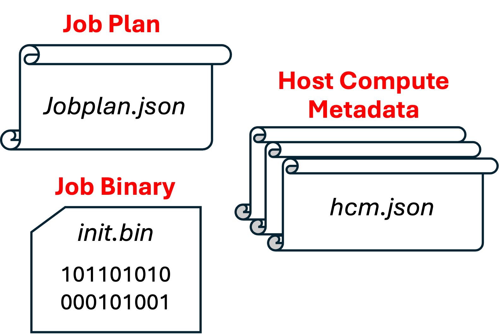

# SpyreCode Interface Specification

**Authors:**
* @ksarada
* @viji560
* @vswagath1989

## **Summary**
This document describes `SpyreCode` the artifacts produced by the Deeptools backend compiler for consumption by the torch-spyre device runtime to launch and execute a kernel (job) on Spyre.

## **Motivation**
`SpyreCode` is the contract between compiler and runtime to facilitate consumption of compilation artifacts for job launch during execution.

## **Proposed Implementation**

### Terminology and Backgroud Notes:
The execution of a computation kernel on the Spyre device is referred to as a <u>job</u>. The <u>computation kernel</u>  comprises of sequence of operations, uses dynamic shapes with input/output tensors resident on host or device. Job execution on Spyre involves a combination of executing programs on Spyre cores (using a compute control block) and transfers between host &#8660; Spyre (using a DMA control block). Jobs executed on Spyre use a (maximum) 128GB virtual address space, split into 8 segments each having a maximum length of 16GB.

### Components of `SpyreCode`
`SpyreCode` facilites the runtime to execute a job on Spyre. It comprises of 3 components:
* Job plan
* Job Binary a.k.a. `init.bin`
* Host Compute Metadata

<p align="center">
  
</p>
<p align="center">
  Figure 1. Components of `SpyreCode`
</p>  

In the virtual address space corresponding to a job, the last segment (SegmentId=7) is **reserved for use by `SpyreCode`**. This excludes SegmentId=7 from being used for data tensors allocated by user-code (using .to() operation) or by compiler fronend (torch-inductor) generated code.

The following sections detail the different components of `SpyreCode`.

### Job Plan

The Job plan is a JSON object containing a list of commands (List\<JobPlanCommand\>). The runtime executes the commands in sequence to complete the execution of the job. Each command in the job plan is comprised of a command type and its associated attributes.

The command types in `JobPlanCommand` and their attributes are explained below:
* `ComputeOnHost`: Triggers execution of a predefined host function API. Its attributs are:
  * `ihandle`: A handle for the input tensor used as input to the host function. If the Job has runtime input arguments (e.g., a kernel with symbolic start addresses), then those input arguments are concatenated to form a meta tensor called `iargs`. The host function will use meta tensor as its input `ihandle=iargs`. NOTE: While the command attribute describes the tensor using a handle, the host function itself will take a pointer or reference to that tensor so as to process its contents during execution.
  * `ishape`: Shape of the tensor fed to `ihandle`
  * `ohandle`: A handle for the output tensor produced by the host function API. This output tensor could be transferred to the device or fed to another host function.
  * `oshape`: Shape of the tensor fed to `ohandle`
  * `hcm`: A json object that contains metadata needed by the host function for its processing. This json object is produced by the backend compiler as part of `SpyreCode`
* `ComputeOnDevice`: Triggers execution of computation on Sypre Cores. This is achieved by runtime sending a control message to the card firmware which generates a compute control block (CB). Its attributes are:
  * `job_bin_ptr`: Starting virtual address of the job binary (limited to SegmentId=7). Spyre requires start address to be a multiple of 128B.
* `DataTransfer`: Triggers a data transfer between host and Sypre.The runtime sends a control message to the card firmare to generate a DMAI or DMAO control block to effect the transfer. Its attributes are:
  * `direction`: `0` indicates transfer to device and `1` indicates transfer from device
  * `host_handle`: A handle for the tensor on the host side.
  * `size`: Size of the data transfer (in Bytes)
  * `dev_ptr`: Starting virtual address where the tensor resides in the device (limited to SegmentId=7). Spyre requires start address to be a multiple of 128B.
* `Allocate`: Requests the runtime to allocate space on the device memory. From a virtual address point-of-view, the space is allocated in SegmentId=7 starting from address 0. The 3 uses of the space are: (a) to store the job binary (programs that will run on Spyre cores), (b) to store data needed to effect program correction supporting symbolic start address and tensor/compute shapes and (c) (if required) intermediate data tensors that are allocated in the device memory during backend compilation.
  * `size`: Size of allocation (in Bytes)
  * `breakdown_jobbinary`: Size of job binary (in Bytes)
  * `breakdown_correctiondata`: Size of the data needed for program correction owing to symbolic start address and shapes (in Bytes)
  * `breakdown_tensordata`: Size of intermediate data tensors that spilled over to device memory (in Bytes)

### Job Binary a.k.a. `init.bin`

The `init.bin` is a binary file (not in text format) that contains all programs for the kernel. The runtime is responsible for transferring the job binary from host to the Spyre device’s memory. The job binary is required to be placed at virtual address \<SegmentId=7, address 0\>.

### Host Compute metadata:

The host compute metadata is provided as an input to the `ComputeOnHost` job command. It contains information needed to process the input tensor produce an output tensor that can then be transferred to the device. An example of the use of host compute metadata in the context of kernel execution with symbolic start address and shapes is described in
[example](#example2-job-plan-with-program-correction) below.

### Execution Flow Examples

#### Example1: Job plan for execution of a kernel with fixed tensor addresses and shapes

```
1. Allocate size=49152, breakdown_jobbinary=32768, breakdown_correctiondata=0, breakdown_tensordata=16384
2. ComputeOnDevice job_bin_ptr=0x1C00000000
```

In this example, the compute kernel has tensors with fixed addresses and shapes. In this case, the job plan in `SpyreCode` comprises of a sequence of 2 commands, an `Allocate` and a `ComputeOnDevice`. The `Allocate` indicates total amount of memory the needs to be reserved in SegmentId=7. In this example, a total of 49512 bytes is shown in the `size` attribute. The command further provides a breakdown of the 49512 bytes into 32768 bytes used to store the job binary (`breakdown_jobbinary`) and 16384 bytes used to hold an intermediate data tensor (`breakdown_tensordata`). The `ComputeOnDevice` launches execution on Spyre with the job binary located at a virtual address of 0x1C00000000.

#### Example2: Job plan for execution of a kernel with symbolic tensor addresses and shapes

This ia a more complex example, wherein the compute kernel has tensors with symbolic start addresses and shapes. The symbol values are known only during kernel invocation and can change across consecutive lauches of the same kernel. They are fed as input arguments when the kernel is invoked.

With symbolic tensor address/shapes, the job binary produced by the backend compiler cannot be executed as-is on the hardware. It needs to be edited just-in-time knowing the symbol values. This process is referred to as *program correction*. It is accomplished using the following job plan.

```
1. Allocate size=51200, breakdown_jobbinary=32768, breakdown_correctiondata=2048, breakdown_tensordata=16384
2. ComputeOnHost ihandle=iargs, ishape=[4], ohandle=T1, oshape=[16 128], hcm=hcm.json
3. DataTransfer direction=0 host_handle=T1 size=2048 dev_ptr=0x1C00008000
4. ComputeOnDevice job_bin_ptr=0x1C00000000
```

In this case, the job plan comprises of 4 commands.
* The first command is `Allocate` where 51200 bytes of data is requested, 32768 bytes for the job binary, 16384 bytes for tensor data and an additional 2048 bytes for storing data needed for program correction.
* The second command is to execute a host function `ComputeOnHost`, which takes the input arguments (4 in this case) and the host compute metadata (*hcm.json*) as its inputs, and produces a data tensor (T1) needed for program correction. The *hcm.json* contains information pertaining to how the input arguments (symbols) must be interpreted in the context of the job binary. For example, if a shape of a dimension in a tensor is symbolic during compilation, then its value (provided as part of input arguments) will be used to correct one of loop counts in the job binary.
* The third command transfers T1 to the device to a specific location indicated by the *dev_ptr*
* Finally, the last command executes the job binary. In this case, the job binary contains additional program instructions (which are executed on Sypre core) to first read T1 and make corrections to future program instructions. Then the corrected program instructions are executed (on Spyre cores), successfully completing the kernel execution with the desired tensor address/shape.

## **Metrics **

## **Drawbacks**

## **Alternatives**

## **Prior Art**

## **How we teach this**

## **Unresolved questions**

## Resolution

### Level of Support
Choose one of the following:
* 1: Overwhelming positive feedback.
* 2: Positive feedback.
* 3: Majority Acceptance, with conflicting Feedback.
* 4: Acceptance, with Little Feedback.
* 5: Unclear Resolution.
* 6: RFC Rejected.
* 7: RFC Rejected, with Conflicting Feedback.

#### Additional Context
Some people were in favor of it, but some people didn’t want it for project X.

### Next Steps
Will implement it.

#### Tracking issue
https://github.com/torch-spyre/torch-spyre/issues/277

#### Exceptions
